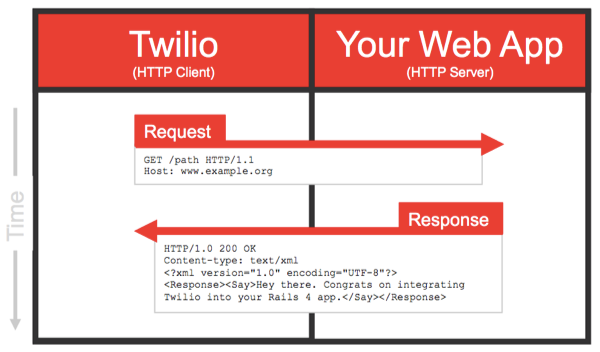

Twilio utiliza **webhooks** para informarle a tu aplicación cuando se recibe un mensaje. Cuando se produce el evento, Twilio realiza una **solicitud HTTP sincrónica**  (generalmente una POST o una GET) a la URL configurada al telefono, la solicitud de Twilio incluye detalles del evento, descritos en la **tabla  [Parametros de Solicitud](#par%c3%a1metros-de-solicitud)**. La solicitud HTTP se realiza como un navegador web normal, en el formato application **x-www- form-urlencoded**. Cuando Twilio recibe un mensaje para uno de sus números, espera recibir **TwiML** en respuesta. 
Twilio envía los siguientes **parámetros** con su solicitud como parámetros POST o parámetros de consulta URL, según el método HTTP que haya configurado:

### Parámetros de solicitud

PARÁMETRO | DESCRIPCIÓN 
---|---
MessageSid | Un identificador único de 34 caracteres para el mensaje. Puede usarse para recuperar más tarde este mensaje de la API REST.
SmsSid | Mismo valor que MessageSid . En desuso e incluido por compatibilidad con versiones anteriores.
AccountSid | La identificación de 34 caracteres de la cuenta a la que está asociado este mensaje.
MessagingServiceSid | La identificación de 34 caracteres del servicio de mensajería asociado con el mensaje.
From |El número de teléfono o la dirección del canal que envió este mensaje.
To | El número de teléfono o la dirección del canal del destinatario.
Body | El cuerpo del texto del mensaje. Hasta 1600 caracteres de largo.
NumMedia | El número de elementos multimedia asociados con su mensaje.
Twilio también envía los siguientes parámetros cuando hay medios, como imágenes, asociados con el mensaje:

PARÁMETRO | DESCRIPCIÓN 
----------|------------
MediaContentType {N} | Los ContentTypes para los medios almacenados en MediaUrl {N}. El orden de MediaContentType {N} coincide con el orden de MediaUrl {N}. Si más de un elemento de los medios de comunicación se indica mediante NumMedia que MediaContentType {N} se utilizarán, donde N es el índice de base cero de los medios de comunicación (por ejemplo MediaContentType0)
MediaUrl {N} | Una URL que hace referencia al contenido de los medios recibidos en el Mensaje. Si más de un elemento de los medios de comunicación se indica mediante NumMedia que mediaUrl será utilizado {N}, donde N es el índice de base cero de los medios de comunicación (por ejemplo MediaUrl0)

## Cómo funciona el intérprete TwiML de Twilio
Cuando tu aplicación responde a una solicitud de Twilio con XML, Twilio ejecuta el documento a través del intérprete TwiML. El lenguaje TwiML  consiste en : el elemento raíz **Response, "verbos" y "sustantivos".** 
 
Solo hay un verbo de mensaje TwiML básico y un verbo secundario, con documentación detallada sobre cada uno. El verbo central es:
<Message>: envía un mensaje en respuesta al mensaje entrante.
 
Los siguientes verbos pueden afectar el flujo de control: <Message> y <Redirect>
 
## Utilizando Lambdas como Webhook

Podemos utlizar una lamda conectada a la definición de un **API Gateway* como nuestra aplicación web que se ejecute cuando se mandan mensajes a nuestro numero. 
Necesitamos asignar un tipo de contenido de aplicación **x-www-form-urlencoded** a JSON para que funcione correctamente con API Gateway y Lambda. El siguiente código lo utilizaremos como plantilla de mapeo en la solicitud de integración para realizar la conversión de application/x-www-form-urlencoded a Json:

```bash
#set ($ httpPost = $ input.path ('$'). split ("&"))
{
#foreach ($ kvPair en $ httpPost )
#set ($ kvTokenised = $ kvPair.split ("="))
#if ($ kvTokenised.size ()> 1)
   "$ kvTokenised [0]": "$ kvTokenised [1]" # if ($ foreach.hasNext ), # end
#más
   "$ kvTokenised [0]": "" #if ($ foreach.hasNext ), # end
#final
#final
}
```


Este código  divide nuestros parámetros HTTP en pares clave/valor JSON.
Necesitamos hacer unión a partir de la salida de nuestra función Lambda. Generalmente en la respuesta de yb 200 y, a veces, un 401 a la solicitud de Twilio. Twilio espera como respuesta un **application/xml**. Por lo que habrá que hacer una integración en el API Gateway con el código 200 de respuesta y la siguiente plantilla de mapeo en la Respuesta de integración:

```
 $input.path('$')
```

A continuación podemos crear nuestra Lambda y subir nuestro paquete de despliege en Java con la estructura que se encuentra en la [guia lambda](2020-04-27-AWS-Lambdas.md).
Es importante recalcar que en esté caso Twilio mandara la petición a la lambda por medio de nuestro end-point descrito en lambda (POST o GET) con los parametros descritos en la [tabla](#par%c3%a1metros-de-solicitud) almacenados en la variable local **event** y está misma lambda deberá contestar con un formato TwiML que puede generarse con ayuda del SDK que se importa a nuestro proyecto.
